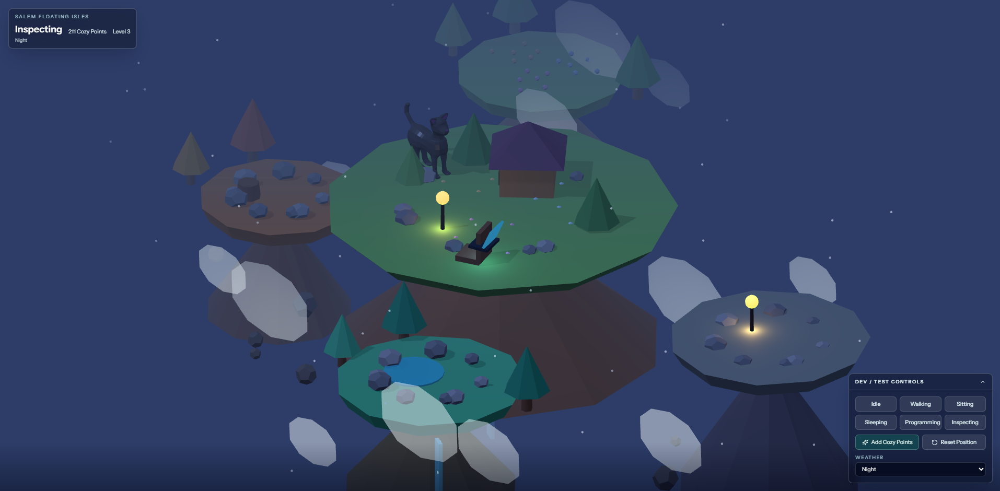

# Rechi OS

Portfolio pessoal de Caique Rechi em formato de sistema operacional: janelas, dock, terminal seguro, projetos como apps e area administrativa protegida.

## Salem Floating Isles v1

Registro da primeira versao visual do mini-game `/salem`.



## Stack

- Laravel 13, PHP 8.3+, React, TypeScript, Inertia, Tailwind CSS e Vite.
- MySQL, Redis, filas Redis, Mailpit, Laravel Sanctum e Laravel Telescope.
- PHPUnit, Vitest, React Testing Library, Pint, Larastan, ESLint e Prettier.

## Rodando localmente

1. Copie `.env.example` para `.env`.
2. Preencha `ADMIN_EMAIL` e `ADMIN_PASSWORD` se quiser criar o primeiro admin pelo seeder.
3. Suba os servicos:

```bash
docker compose up -d
docker compose exec app composer install
docker compose exec app php artisan key:generate
docker compose exec app php artisan migrate --seed
docker compose exec node npm install
docker compose exec node npm run dev
```

No Windows sem Docker, use PHP 8.3, Composer, Node 24 e um MySQL/Redis locais, ajustando `DB_HOST` e `REDIS_HOST` para `127.0.0.1`.

## Admin

O registro publico foi desativado. Crie um admin com:

```bash
php artisan portfolio:create-admin email@dominio.com
```

## Verificacoes

```bash
composer validate
vendor/bin/pint --test --parallel
vendor/bin/phpstan analyse
npm run lint:check
npm run types:check
php artisan test
npm run test:react
npm run build
```

## Variaveis principais

- `ADMIN_EMAIL`, `ADMIN_PASSWORD`: admin inicial opcional via seeder.
- `OPENAI_API_KEY`, `OPENAI_MODEL`: assistente Ask Rechi.
- `DB_*`, `REDIS_*`, `CACHE_STORE`, `QUEUE_CONNECTION`, `SESSION_DRIVER`: infraestrutura local.
